# AttorneyI - Legal News & Updates Platform

[](https://kotlinlang.org/docs/multiplatform.html)
[](https://www.jetbrains.com/lp/compose-multiplatform/)
[](https://developer.android.com/)
[](https://developer.apple.com/ios/)
[](https://developer.android.com/guide/topics/manifest/uses-sdk-element)
[](https://developer.apple.com/ios/)

## Overview

AttorneyI is a cross-platform legal news and updates application built with Kotlin Multiplatform and Compose Multiplatform. The application provides legal professionals and enthusiasts with real-time access to curated legal news, case updates, regulatory changes, and industry insights from trusted legal sources.

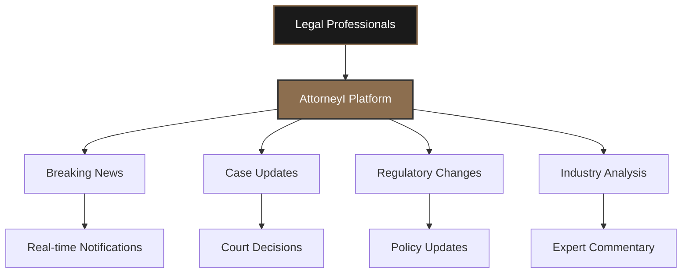

## Product Philosophy

AttorneyI is designed as a comprehensive legal information platform that bridges the gap between complex legal developments and accessible, actionable insights. The application serves as a centralized hub for legal professionals to stay informed about:

- **Breaking Legal News**: Real-time updates on significant legal developments
- **Case Law Updates**: Latest court decisions and their implications
- **Regulatory Changes**: New laws, amendments, and policy updates
- **Industry Analysis**: Expert commentary and legal trend analysis
- **Practice Area Insights**: Specialized content across different legal domains

## Technical Architecture

### Platform Architecture Overview

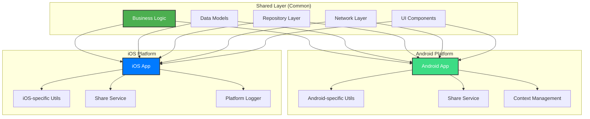

### Core Technology Stack

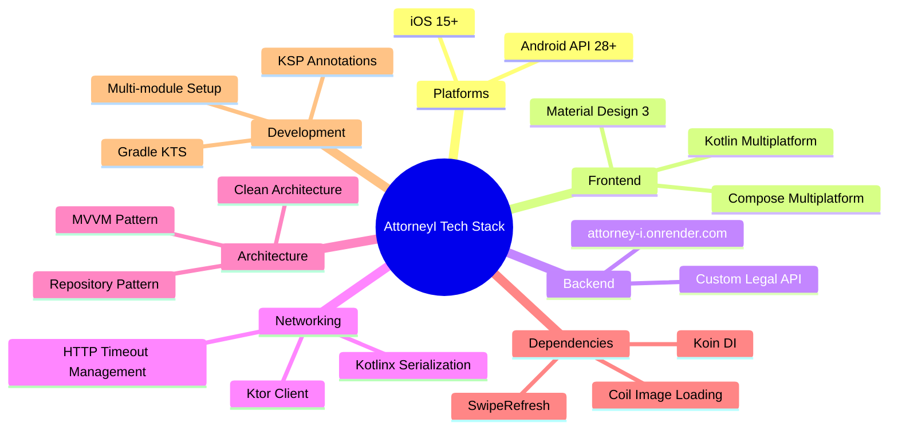

**Framework & Platform**
- **Kotlin Multiplatform**: Shared business logic across Android and iOS platforms
- **Compose Multiplatform**: Modern declarative UI framework for both platforms
- **Target Platforms**: Android (API 28+) and iOS (iOS 15+)

**Networking & Data**
- **Ktor Client**: Type-safe HTTP client for API communication
- **Kotlinx Serialization**: JSON serialization and deserialization
- **Custom Legal News API**: Backend service hosted at `attorney-i.onrender.com`

**Architecture Pattern**
- **MVVM (Model-View-ViewModel)**: Clean separation of concerns
- **Repository Pattern**: Centralized data access layer
- **Dependency Injection**: Koin framework for modular dependency management

**UI & User Experience**
- **Material Design 3**: Modern, accessible design system
- **Coil**: Efficient image loading and caching
- **SwipeRefresh**: Pull-to-refresh functionality
- **Responsive Design**: Adaptive layouts for different screen sizes

### Data Flow Architecture

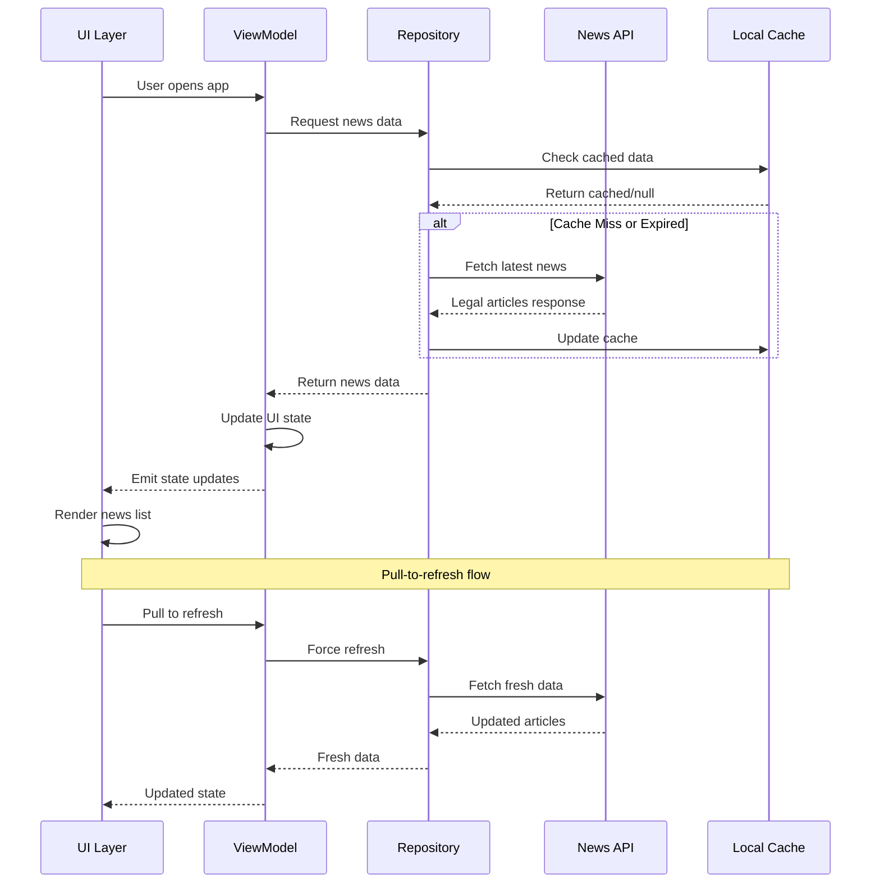

### Key Features

**Content Discovery**
- Advanced search functionality with real-time filtering
- Tag-based categorization system for legal topics
- Breaking news notifications and highlights
- Source-based content filtering

**User Experience**
- Intuitive navigation and content consumption
- Offline reading capabilities
- Share functionality for articles and insights
- Dark/Light theme support

**Performance Optimizations**
- Efficient image loading and caching
- Network request optimization with timeouts
- Lazy loading for large content lists
- State management for seamless user experience

## Development Setup

### Prerequisites

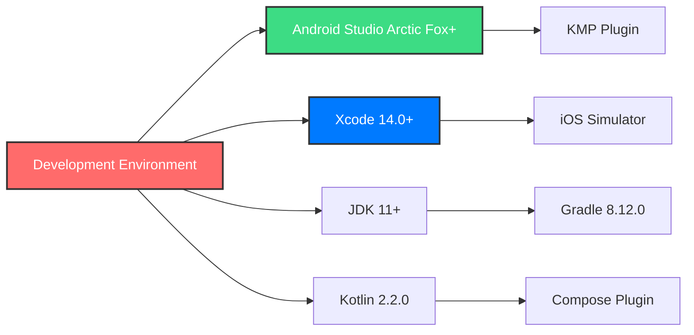

- **Android Studio**: Arctic Fox or later with Kotlin Multiplatform plugin
- **Xcode**: 14.0+ (for iOS development)
- **JDK**: Version 11 or higher
- **Kotlin**: Version 2.2.0
- **Gradle**: Version 8.12.0

### Local Configuration

1. **Clone the Repository**
   ```bash
   git clone <repository-url>
   cd AttorneyI
   ```

2. **Configure API Keys**
   Create a `local.properties` file in the root directory:
   ```properties
   # Android SDK path (auto-generated)
   sdk.dir=/path/to/your/android/sdk
   
   # Required: GNews API Key for fallback news sources
   GNEWS_API_KEY=your_gnews_api_key_here
   ```

3. **Install Dependencies**
   ```bash
   ./gradlew build
   ```

4. **Platform-Specific Setup**

   **Android**
   ```bash
   # Open project in Android Studio
   # Sync Gradle files
   ./gradlew :composeApp:assembleDebug
   ```

   **iOS**
   ```bash
   # Generate Xcode project
   ./gradlew :composeApp:embedAndSignAppleFrameworkForXcode
   # Open iosApp/iosApp.xcodeproj in Xcode
   ```

### Build Process Visualization

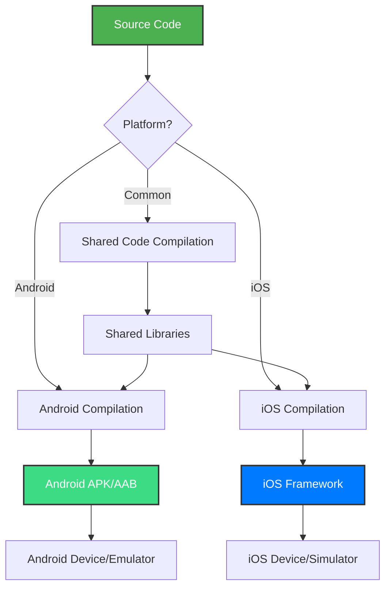

### Environment Variables

The application requires the following configuration in `local.properties`:

| Variable | Purpose | Required | Example |
|----------|---------|----------|---------|
| `GNEWS_API_KEY` | GNews API access for fallback content | Yes | `c3195bbf527fa50eadc52d64c40e1d86` |
| `sdk.dir` | Android SDK path | Yes (Android only) | `/Users/username/Library/Android/sdk` |

### Build Variants

- **Debug**: Development build with logging enabled
- **Release**: Production-ready build with optimizations

## Project Architecture

### Module Organization

```
composeApp/
├── src/
│   ├── commonMain/          # Shared code across platforms
│   │   ├── kotlin/
│   │   │   ├── data/        # Data layer (repositories, models, APIs)
│   │   │   │   ├── config/  # API configuration
│   │   │   │   ├── model/   # Data models and DTOs
│   │   │   │   ├── remote/  # Network API services
│   │   │   │   └── repository/ # Repository implementations
│   │   │   ├── di/          # Dependency injection modules
│   │   │   ├── presentation/ # UI layer (screens, ViewModels)
│   │   │   │   ├── legalUpdates/ # News feature module
│   │   │   │   │   ├── components/ # Reusable UI components
│   │   │   │   │   └── state/ # UI state management
│   │   │   │   └── ui/      # Theme and design system
│   │   │   └── utils/       # Shared utilities
│   ├── androidMain/         # Android-specific implementations
│   │   └── kotlin/
│   │       ├── utils/       # Android platform utilities
│   │       └── data/config/ # Android platform config
│   └── iosMain/            # iOS-specific implementations
│       └── kotlin/
│           ├── utils/       # iOS platform utilities
│           └── data/config/ # iOS platform config
```

### Dependency Graph

```mermaid
graph TB
    subgraph "Presentation Layer"
        A[NewsScreen]
        B[NewsViewModel]
        C[UI Components]
    end
    
    subgraph "Domain Layer"
        D[Repository Interface]
        E[Use Cases]
    end
    
    subgraph "Data Layer"
        F[NewsRepository]
        G[NewsApiService]
        H[Data Models]
    end
    
    subgraph "Platform Layer"
        I[Android Utils]
        J[iOS Utils]
        K[Share Service]
    end
    
    A --> B
    B --> D
    B --> E
    D --> F
    F --> G
    F --> H
    
    A --> I
    A --> J
    C --> K
    
    classDiagram
    class NewsScreen {
        +Composable content()
        +LazyColumn newsItems
        +SearchBar searchFeature
        +PullRefresh refreshLogic
    }
    
    class NewsViewModel {
        +StateFlow~NewsUiState~ uiState
        +searchQuery: String
        +loadNews()
        +searchNews(query)
        +refreshNews()
    }
    
    class NewsRepository {
        +suspend getNews()
        +suspend searchNews(query)
        +Flow~List~Article~~ newsFlow
    }
    
    class NewsApiService {
        +suspend fetchNews()
        +HttpClient client
        +handleResponse()
    }
    
    NewsScreen --> NewsViewModel
    NewsViewModel --> NewsRepository
    NewsRepository --> NewsApiService
    
    class AndroidShareService {
        +share(title, url)
        +Intent createShareIntent()
    }
    
    class IOSShareService {
        +share(title, url)
        +UIActivityViewController
    }
```

**NewsScreen**: Main interface displaying legal news and updates
**NewsViewModel**: Manages news data, search, and filtering logic
**NewsRepository**: Handles data fetching and caching
**NewsApiService**: Network interface for legal news API

## API Integration

### API Architecture

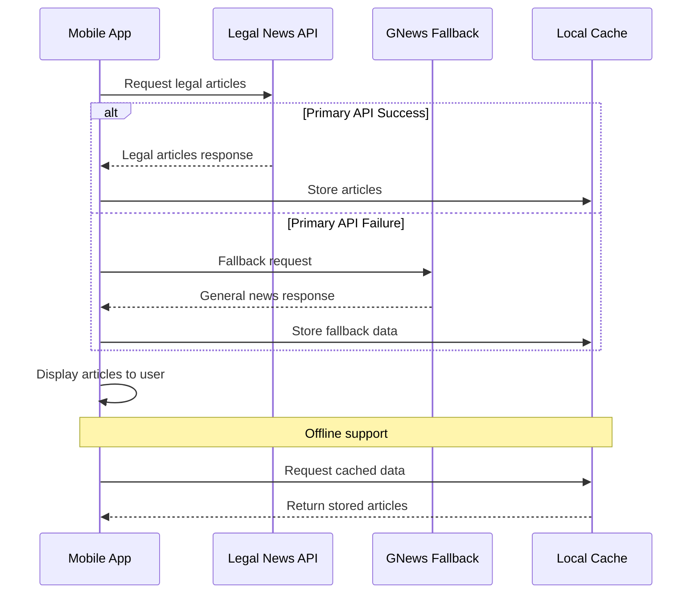

### Legal News API

The application integrates with a custom legal news API that provides:

- **Endpoint**: `https://attorney-i.onrender.com/api`
- **Authentication**: API key-based authentication
- **Rate Limiting**: Respectful API usage with built-in timeouts
- **Response Format**: JSON with standardized legal article structure

### Data Models

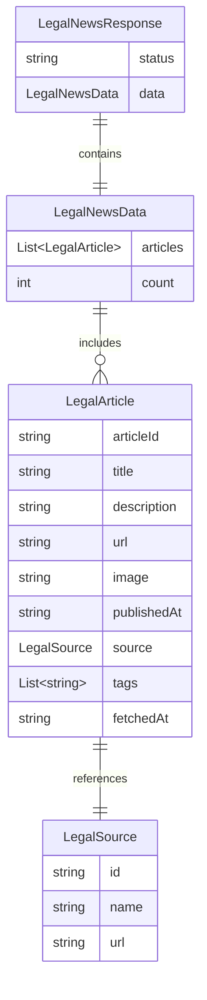

- **LegalArticle**: Core news article with legal metadata
- **LegalSource**: Trusted legal publication information
- **LegalNewsResponse**: API response wrapper with status and data

## Testing Strategy

### Test Pyramid

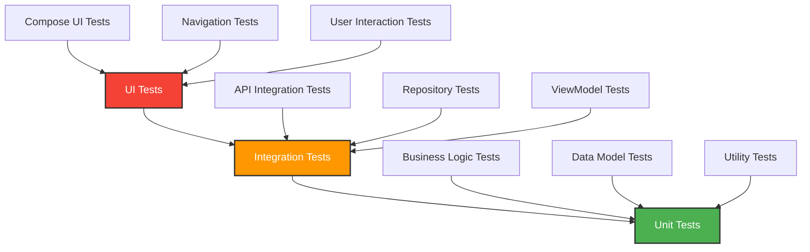

### Test Coverage
- **Unit Tests**: Business logic and data layer testing
- **UI Tests**: User interaction and navigation testing
- **Integration Tests**: API and data flow validation

### Quality Assurance
- **Code Linting**: Kotlin coding standards enforcement
- **Static Analysis**: Code quality and security scanning
- **Performance Monitoring**: Memory and network usage optimization

## Contribution Guidelines

### Development Workflow

```mermaid
gitgraph
    commit id: "main"
    branch feature-branch
    checkout feature-branch
    commit id: "implement feature"
    commit id: "add tests"
    commit id: "update docs"
    checkout main
    merge feature-branch
    commit id: "release"
```

1. **Fork and Clone**: Create your development environment
2. **Feature Branch**: Create feature-specific branches from `main`
3. **Development**: Follow established coding standards and patterns
4. **Testing**: Ensure all tests pass and add new tests for features
5. **Documentation**: Update relevant documentation
6. **Pull Request**: Submit for code review with detailed description

### Code Standards

- **Kotlin Coding Conventions**: Follow official Kotlin style guide
- **Compose Best Practices**: Implement efficient, reusable UI components
- **Clean Architecture**: Maintain clear separation between layers
- **Documentation**: Comprehensive KDoc for public APIs

### Commit Guidelines

```
feat: add new legal category filtering
fix: resolve search performance issue
docs: update API integration guide
test: add unit tests for news repository
refactor: optimize article loading logic
```

### Review Process

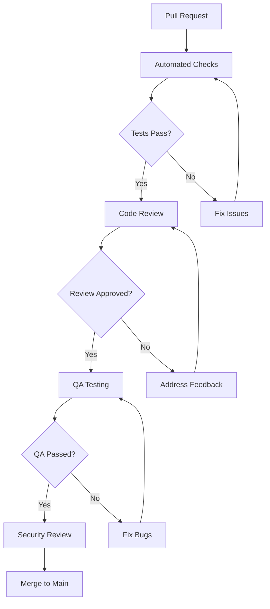

1. **Automated Checks**: CI/CD pipeline validation
2. **Code Review**: Peer review for code quality and standards
3. **QA Testing**: Functional and regression testing
4. **Security Review**: Security best practices validation

## Deployment & Distribution

### Release Pipeline

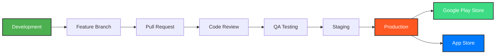

### Android
- **Google Play Store**: Production releases
- **Internal Testing**: Firebase App Distribution for beta testing

### iOS
- **App Store**: Production releases
- **TestFlight**: Beta testing and internal distribution

### Release Management
- **Semantic Versioning**: Major.Minor.Patch version scheme
- **Release Notes**: Detailed changelog for each release
- **Feature Flags**: Gradual rollout of new features

## Performance Considerations

### Performance Optimization Strategy

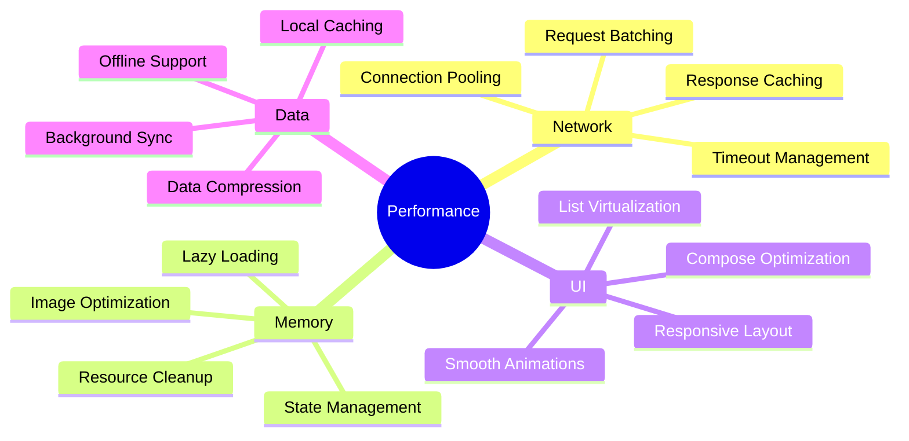

### Network Optimization
- **Request Batching**: Efficient API call management
- **Caching Strategy**: Local storage for offline access
- **Image Optimization**: Coil-based image loading with compression

### Memory Management
- **Lazy Loading**: On-demand content loading
- **State Management**: Efficient ViewModel state handling
- **Resource Cleanup**: Proper disposal of resources and subscriptions

## Support & Maintenance

### Monitoring Dashboard

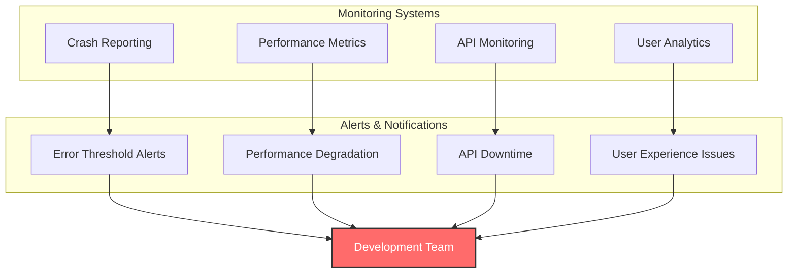

### Monitoring
- **Crash Reporting**: Comprehensive error tracking and analysis
- **Performance Metrics**: App performance and user experience monitoring
- **Analytics**: User behavior and feature usage insights

### Documentation
- **API Documentation**: Comprehensive API integration guides
- **Development Guides**: Setup and contribution documentation
- **User Guides**: End-user feature documentation

---

## License

This project is proprietary software developed for commercial use. All rights reserved.

## Contact

For technical inquiries, feature requests, or support, please contact the development team through the designated internal channels.

---

**Note**: This is a company product under active development. All contributors must adhere to established development workflows, security protocols, and quality standards. Regular updates to documentation and dependencies are maintained to ensure optimal performance and security.
